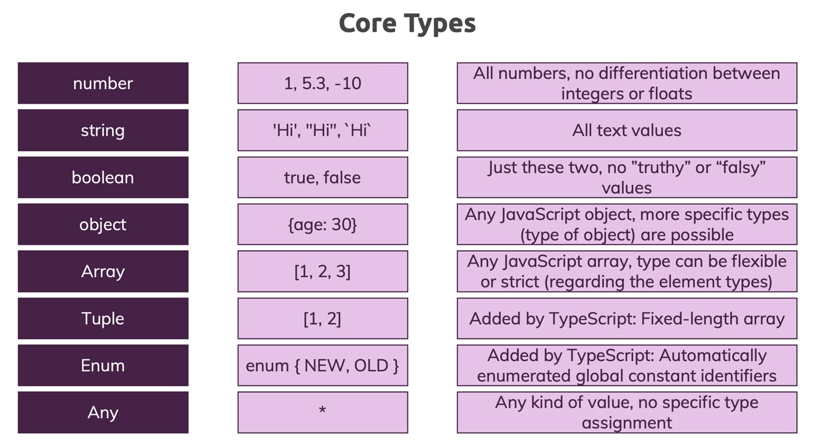

<div align = "center">
  
</div>

<hr>

## Table of Contents

- [What is TypeScript?](#what-is-typescript)
- [Why do we care about types?](#why-do-we-care-about-types)
- [Why should I use TypeScript](#why-should-i-use-typescript)
- [TypeScript Basics & Basic Types](#typescript-basics-and-basic-types)
- [Literal Types](#literal-types)
- [Type Assignment](#type-assignment)
- [TypeScript Special Types](#typesctip-special-types)
- [TypeScript Arrays](#typescript-array)
- [TypeScript Tuples](#typescript-tuples)
- [TypeScript Object Types](#typescript-object-types)
- [TypeScript Enums](#typescript-enums)
- [TypeScript Type Aliases and Interfaces](#typescript-type-aliases-and-interfaces)
- [TypeScript Union Types](#typescript-union-types)
- [TypeScript Functions](#typescript-functions)
- [TypeScript Casting](#typescript-casting)
- [TypeScript Classes](#typescript-classes)
- [TypeScript Basic Generics](#typescript-basic-generics)
- [TypeScript Utility Types](#typescript-utility-types)
- [TypeScript Keyof](#typescript-keyof)
- [TypeScript Null & Undefined](#typescript-null-and-undefined)
- [Instance Method Modifiers](#instance-method-modifiers)
- [TypeScript Interface](#typescript-interface)
- [Interface VS Type Alias](#interface-vs-type-alias)
- [Creating Types From Types](#creating-types-from-types)
- [CheetSheats](#cheetsheats)

## FURTHER LEARNING

- [The TypeScript release notes](https://devblogs.microsoft.com/typescript/) covers a each new features in-depth.
- [The TypeScript handbook](https://www.typescriptlang.org/docs/handbook/) is the official documentation for TypeScript, and covers most key language features.

# What is TypeScript?

TypeScript is a **_free and open-source_** programming language developed and maintained by Microsoft. It is also a **_strict syntactical superset_** of JavaScript which allows developers to work the type system it provides.

# Why do we care about types?

1. **Early Error Detection**: Types catch errors at compile time, reducing bugs that would only appear at runtime.
2. **Enforce Best Practices**: By using types, developers are encouraged to think more about the structure and design of their code. This often leads to better design patterns and more thoughtful architecture decisions. 
3. **Improved Code Quality and Readability**: Types act as documentation, making the code more understandable and easier to read.
4. **Better Refactoring**: Strong typing makes refactoring safer, ensuring that changes are consistently applied across the codebase.
5. **Scalability**: Types help manage complexity in large codebases, making them easier to maintain and scale.

# Why should I use TypeScript?

JavaScript is a loosely and dynamically typed language. Due to this downside of JavaScript, TypeScript is very usefeul because:

1. Simplifies JavaScript code, making it easier to read, understand, maintain and debug, while doing it in a clean way.
2. Uses compile time type checking. Which means it checks if the specified types match **before** running the code, not **while** running the code.
3. It helps in code structuring.
4. Adds type support to JavaScript, and makes typing a bit easier and a lot less explicit by the usage of type inference. The type system of TypeScript is relatively rich and includes: interfaces, enums, hybrid types, generics, union and intersection types, access modifiers and much more.
5. TypeScript supports new ECMAScript standards and can also compile them to (older) ECMAScript targets of your choosing. This means that you can use features of ES2015 and beyond, like modules, lambda functions, classes, the spread operator, destructuring, today.

# TypeScript Basics And Basic Types

<div aign="center">
  
</div>

1. **boolean**: Used to define logic values (_true_ or _false_).
2. **number**: They represent _whole numbers_ and _floating point_ values.
3. **string**: It represents _text values_ like "TypeScript Rocks".
4. **object**: It's a collection of _named values_ which are called _properties_ written as **key : value** pairs. The values can be scalar values or functions or even array of other objects.
5. **array**: It's a homogenous collection of values. In other words, an array is a collection of values of the same data type. It is a user defined type.
6. **tuple**: It represents a heterogeneous collection of values. It's a typed array with a pre-defined length and types for each index.
7. **enums**: They allow to define a set of _named constants_. Using enums can make it easier to create a set of distinct cases. TypeScript provides both numeric and string-based enums.
8. **any**: Allows you to assign a value of any type to a variable.

Take a look at the [Everyday Types](https://www.typescriptlang.org/docs/handbook/2/everyday-types.html).

# Literal Types

A literal is a more concrete sub-type of a collective type. What this means is that `"Hello World"` is a _string_, but a _string_ is not `"Hello World"` inside the type system.

There are three sets of literal types available in TypeScript today: strings, numbers, and booleans; by using literal types you can allow an exact value which a string, number, or boolean must have.

```Typescript
// Example #1
type Easing = "ease-in" | "ease-out" | "ease-in-out";

// Example #2
interface ValidationSuccess {
  isValid: true;
  reason: null;
}

interface ValidationFailure {
  isValid: false;
  reason: string;
}

type ValidationResult = ValidationSuccess | ValidationFailure;
```

# Type Assignment

When creating a variable, there are two main ways TypeScript assigns a type: Explicit or Implicit,

In both examples below `firstName` is of type `string`.

## Explict Type or Type Annotation

**Explicit** - Code we add to tell TypeScript what type of value a variable will refer to. They are easier to read and more intentional.

```Typescript
 let firstName: string = "Dylan";
```

## Implicit Type or Type Inference

**Implicit** - TypeScript tries to figure out what type of value a variable refers to.

<div aign="center">
  
</div>

```Typescript
 let firstName = "Dylan";
```

## Unable to Infer

TypeScript may not always properly infer what the type of a variable may be. In such cases, it will set the type to `any` which disables type checking.

```Typescript
// Implicit any as JSON.parse doesn't know what type of data it returns so it can be "any" thing...
const json = JSON.parse("55");
// Most expect json to be an object, but it can be a string or a number like this example
console.log(typeof json);
```

This behavior can be disabled by enabling `noImplicitAny` as an option in a TypeScript's project `tsconfig.json`. That is a JSON config file for customizing how some of TypeScript behaves.

So, when are we going to add in Type Annotations? When are we going to type them out? if we're saying that TypeScript can figure out these different types for us, why would we go through the process of writting out the annotations manually?

<div aign="center">
  
</div>

<br />

[Referece To The Official Documentation](https://www.typescriptlang.org/docs/handbook/type-inference.html)

# TypeScript Special Types

TypeScript has special types that may not refer to any specific type of data.

## Type: any

`any` is a type that disables type checking and effectively allows all types to be used.

The example below does not use `any` and will throw an error:

```Typescript
let u = true;
u = "string"; // Error: Type 'string' is not assignable to type 'boolean'.
Math.round(u); // Error: Argument of type 'boolean' is not assignable to parameter of type 'number'.
```

Setting `any` to the special type `any` disables type checking:

```Typescript
let v: any = true;
v = "string"; // no error as it can be "any" type
Math.round(v); // no error as it can be "any" type
```

_**IMPORTANT**: any can be a useful way to get past errors since it disables type checking, but TypeScript will not be able provide type safety, and tools which rely on type data, such as auto completion, will not work. Remember, it should be avoided at "any" cost._

## Type: unknown

`unknown` is a similar, but safer alternative to `any`.

TypeScript will prevent `unknown` types from being used, as shown in the below example:

```Typescript
let w: unknown = 1;
w = "string"; // no error
w = {
  runANonExistentMethod: () => {
    console.log("I think therefore I am");
  }
} as { runANonExistentMethod: () => void}
// How can we avoid the error for the code commented out below when we don't know the type?
// w.runANonExistentMethod(); // Error: Object is of type 'unknown'.
if(typeof w === 'object' && w !== null) {
  (w as { runANonExistentMethod: Function }).runANonExistentMethod();
}
// Although we have to cast multiple times we can do a check in the if to secure our type and have a safer casting
```

Compare the example above to the previous example, with `any`.

_IMPORTANT: unknown is best used when you don't know the type of data being typed. To add a type later, you'll need to cast it. Casting is when we use the "as" keyword to say property or variable is of the casted type._

_**IMPORTANT**: Refer to this article to get a detailed explanation between `any` and `unknown` -> https://mariusschulz.com/blog/the-unknown-type-in-typescript_

## Type: never

`never` effectively throws an error whenever it is defined.

```Typescript
let x: never = true; // Error: Type 'boolean' is not assignable to type 'never'.
```

_IMPORTANT: never is rarely used, especially by itself, its primary use is in advanced generics._

## Type: undefined & null

`undefined` and `null` are types that refer to the JavaScript primitives `undefined` and `null` respectively.

```Typescript
let y: undefined = undefined;
let z: null = null;
```

_IMPORTANT: These types don't have much use unless strictNullChecks is enabled in the tsconfig.json file._

<br />

# TypeScript Arrays

TypeScript has a specific syntax for typing arrays.

```Typescript
const names: string[] = [];
names.push("Dylan"); // no error
// names.push(3); // Error: Argument of type 'number' is not assignable to parameter of type 'string'.
```

## Readonly

The `readonly` keyword can prevent arrays from being changed.

```Typescript
const names: readonly string[] = ["Dylan"];
names.push("Jack"); // Error: Property 'push' does not exist on type 'readonly string[]'.
// try removing the readonly modifier and see if it works?
```

## Type Inference

TypeScript can infer the type of an array if it has values.

```Typescript
const numbers = [1, 2, 3]; // inferred to type number[]
numbers.push(4); // no error
// comment line below out to see the successful assignment
numbers.push("2"); // Error: Argument of type 'string' is not assignable to parameter of type 'number'.
let head: number = numbers[0]; // no error
```

# TypeScript Tuples

A **tuple** is a typed array with a pre-defined length and types for each index.

Tuples are great because they allow each element in the array to be a known type of value.

To define a tuple, specify the type of each element in the array:

```Typescript
// define our tuple
let ourTuple: [number, boolean, string];

// initialize correctly
ourTuple = [5, false, 'Coding God was here'];
```

As you can see we have a number, boolean and a string. But what happens if we try to set them in the wrong order:

```Typescript
// define our tuple
let ourTuple: [number, boolean, string];

// initialize incorrectly throws an error
ourTuple = [false, 'Coding God was mistaken', 5];
```

_IMPORTANT: Even though we have a `boolean`, `string`, and `number` the order matters in our tuple and will throw an error._

## Readonly Tuple

A good practice is to make your **tuple** `readonly`.

Tuples only have strongly defined types for the initial values:

```Typescript
// define our tuple
let ourTuple: [number, boolean, string];
// initialize correctly
ourTuple = [5, false, 'Coding God was here'];
// We have no type safety in our tuple for indexes 3+
ourTuple.push('Something new and wrong');
console.log(ourTuple);
```

You see the new valueTuples only have strongly defined types for the initial values:

```Typescript
// define our readonly tuple
const ourReadonlyTuple: readonly [number, boolean, string] = [5, true, 'The Real Coding God'];
// throws error as it is readonly.
ourReadonlyTuple.push('Coding God took a day off');
```

```Text
IMPORTANT:  If you have ever used React before you have worked with tuples more than likely. `useState` returns a tuple of the value and a setter function.

const [firstName, setFirstName] = useState('Dylan') is a common example.

Because of the structure we know our first value in our list will be a certain value type in this case a string and the second value a function.
```

# TypeScript Object Types

TypeScript has a specific syntax for typing objects.

```Typescript
const car: { type: string, model: string, year: number } = {
  type: "Toyota",
  model: "Corolla",
  year: 2009
};
```

[Reference To The Official Documentation](https://www.typescriptlang.org/docs/handbook/2/objects.html)

## Type Inference

TypeScript can infer the types of properties based on their values.

```Typescript
const car = {
  type: "Toyota",
};
car.type = "Ford"; // no error
car.type = 2; // Error: Type 'number' is not assignable to type 'string'.
```

## Optional Properties

Object properties are properties that don't have to be defined in the object definition.

_Example without an optional property_

```Typescript
const car: { type: string, mileage: number } = { // Error: Property 'mileage' is missing in type '{ type: string; }' but required in type '{ type: string; mileage: number; }'.
  type: "Toyota",
};
car.mileage = 2000;
```

_Example with an optional property_

```Typescript
const car: { type: string, mileage?: number } = { // no error
  type: "Toyota"
};
car.mileage = 2000;
```

## Index Signatures

Index signatures can be used for objects without a defined list of properties.

```Typescript
const nameAgeMap: { [index: string]: number } = {};
nameAgeMap.Jack = 25; // no error
nameAgeMap.Mark = "Fifty"; // Error: Type 'string' is not assignable to type 'number'.
```

_IMPORTANT: Index signatures like this one can also be expressed with utility types like Record<string, number>._

# TypeScript Enums

An **enum** is a special "class" that represents a group of constants (unchangeable variables).

Enums come in two flavors `string` and `numeric`. Lets start with numeric.

## Numeric Enums - Default

By default, enums will initialize the first value to `0` and add 1 to each additional value:

```Typescript
enum CardinalDirections {
  North,
  East,
  South,
  West
}
let currentDirection = CardinalDirections.North;
// logs 0
console.log(currentDirection);
// throws error as 'North' is not a valid enum
currentDirection = 'North'; // Error: "North" is not assignable to type 'CardinalDirections'.
```

## Numeric Enums - Initialized

You can set the value of the first numeric enum and have it auto increment from that:

```Typescript
enum CardinalDirections {
  North = 1,
  East,
  South,
  West
}
// logs 1
console.log(CardinalDirections.North);
// logs 4
console.log(CardinalDirections.West);
```

## Numeric Enums - Fully Initialized

You can assign unique number values for each enum value. Then the values will not incremented automatically:

```Typescript
enum StatusCodes {
  NotFound = 404,
  Success = 200,
  Accepted = 202,
  BadRequest = 400
}
// logs 404
console.log(StatusCodes.NotFound);
// logs 200
console.log(StatusCodes.Success);
```

## String Enums

Enums can also contain `strings`. This is more common than numeric enums, because of their readability and intent.

```Typescript
enum CardinalDirections {
  North = 'North',
  East = "East",
  South = "South",
  West = "West"
};
// logs "North"
console.log(CardinalDirections.North);
// logs "West"
console.log(CardinalDirections.West);
```

# TypeScript Type Aliases and Interfaces

TypeScript allows types to be defined separately from the variables that use them.

Aliases and Interfaces allows types to be easily shared between different variables/objects.

## Type Aliases

Type Aliases allow defining types with a custom name (an Alias).

Type Aliases can be used for primitives like string or more complex types such as `objects` and `arrays`:

```Typescript
type CarYear = number
type CarType = string
type CarModel = string
type Car = {
  year: CarYear,
  type: CarType,
  model: CarModel
}

const carYear: CarYear = 2001
const carType: CarType = "Toyota"
const carModel: CarModel = "Corolla"
const car: Car = {
  year: carYear,
  type: carType,
  model: carModel
};
```

## Interfaces

Interfaces are similar to type aliases, except they **only** apply to `object` types.

```Typescript
interface Rectangle {
  height: number,
  width: number
}

const rectangle: Rectangle = {
  height: 20,
  width: 10
};
```

## Extending Interfaces

Interfaces can extend each other's definition.

**Extending** an interface means you are creating a new interface with the same properties as the original, plus something new.

```Typescript
interface Rectangle {
  height: number,
  width: number
}

interface ColoredRectangle extends Rectangle {
  color: string
}

const coloredRectangle: ColoredRectangle = {
  height: 20,
  width: 10,
  color: "red"
};
```

# TypeScript Union Types

**Union types** are used when a value can be more than a single type.

Such as when a property would be `string` or `number`.

## Union | (OR)

Using the `|` we are saying our parameter is a `string` or `number`:

```Typescript
function printStatusCode(code: string | number) {
  console.log(`My status code is ${code}.`)
}
printStatusCode(404);
printStatusCode('404');
```

[Reference To The Official Documentation](https://www.typescriptlang.org/docs/handbook/2/everyday-types.html#union-types)

## Union Type Errors

**Note:** you need to know what your type is when union types are being used to avoid type errors:

```Typescript
function printStatusCode(code: string | number) {
  console.log(`My status code is ${code.toUpperCase()}.`) // error: Property 'toUpperCase' does not exist ontype 'string | number'.
  Property 'toUpperCase' does not exist on type 'number'
}
```

# TypeScript Functions

TypeScript has a specific syntax for typing function parameters and return values.

## Return Type

The type of the value returned by the function can be explicitly defined.

```Typescript
// the `: number` here specifies that this function returns a number
function getTime(): number {
  return new Date().getTime();
}
```

If no return type is defined, TypeScript will attempt to infer it through the types of the variables or expressions returned.

## Void Return Type

The type `void` can be used to indicate a function doesn't return any value.

```Typescript
function printHello(): void {
  console.log('Hello!');
}
```

## Parameters

Function parameters are typed with a similar syntax as variable declarations.

```Typescript
function multiply(a: number, b: number) {
  return a * b;
}
```

If no parameter type is defined, TypeScript will default to using `any`, unless additional type information is available as shown in the Default Parameters and Type Alias sections below.

## Optional Parameters

By default TypeScript will assume all parameters are required, but they can be explicitly marked as optional.

```Typescript
// the `?` operator here marks parameter `c` as optional
function add(a: number, b: number, c?: number) {
  return a + b + (c || 0);
}
```

## Default Parameters

For parameters with default values, the default value goes after the type annotation:

```Typescript
function pow(value: number, exponent: number = 10) {
  return value ** exponent;
}
```

TypeScript can also infer the type from the default value.

## Named Parameters

Typing named parameters follows the same pattern as typing normal parameters.

```Typescript
function divide({ dividend, divisor }: { dividend: number, divisor: number }) {
  return dividend / divisor;
}
```

## Rest Parameters

Rest parameters can be typed like normal parameters, but the type must be an array as rest parameters are always arrays.

```Typescript
function add(a: number, b: number, ...rest: number[]) {
  return a + b + rest.reduce((p, c) => p + c, 0);
}
```

## Type Alias

Function types can be specified separately from functions with type aliases.

```Typescript
type Negate = (value: number) => number;

// in this function, the parameter `value` automatically gets assigned the type `number` from the type `Negate`
const negateFunction: Negate = (value) => value * -1;
```

# TypeScript Casting

There are times when working with types where it's necessary to override the type of a variable, such as when incorrect types are provided by a library.

Casting is the process of overriding a type.

## Casting with as

A straightforward way to cast a variable is using the `as` keyword, which will directly change the type of the given variable.

```Typescript
let x: unknown = 'hello';
console.log((x as string).length);
```

Casting doesn't actually change the type of the data within the variable, for example the following code with not work as expected since the variable x is still holds a number.

```Typescript
let x: unknown = 4;
console.log((x as string).length); // prints undefined since numbers don't have a length
```

TypeScript will still attempt to typecheck casts to prevent casts that don't seem correct, for example the following will throw a type error since TypeScript knows casting a string to a number doesn't makes sense without converting the data:

```Typescript
console.log((4 as string).length); // Error: Conversion of type 'number' to type 'string' may be a mistake because neither type sufficiently overlaps with the other. If this was intentional, convert the expression to 'unknown' first.
```

The Force casting section below covers how to override this.

## Casting with <>

Using <> works the same as casting with `as`.

```Typescript
let x: unknown = 'hello';
console.log((<string>x).length);
```

This type of casting will not work with TSX, such as when working on React files.

## Force casting

To override type errors that TypeScript may throw when casting, first cast to `unknown`, then to the target type.

```Typescript
let x = 'hello';
console.log(((x as unknown) as number).length); // x is not actually a number so this will return undefined
```

# TypeScript Classes

TypeScript adds types and visibility modifiers to JavaScript classes.

## Members: Types

The members of a class (properties & methods) are typed using type annotations, similar to variables.

```Typescript
class Person {
  name: string;
}

const person = new Person();
person.name = "Jane";
```

## Members: Visibility

Class members also be given special modifiers which affect visibility.

There are three main visibility modifiers in TypeScript:

    public - (default) allows access to the class member from anywhere
    private - only allows access to the class member from within the class
    protected - allows access to the class member from itself and any classes that inherit it, which is covered in the inheritance section below

```Typescript
class Person {
  private name: string;

  public constructor(name: string) {
    this.name = name;
  }

  public getName(): string {
    return this.name;
  }
}

const person = new Person("Jane");
console.log(person.getName()); // person.name isn't accessible from outside the class since it's private
```

The `this` keyword in a class usually refers to the instance of the class.

## Parameter Properties

TypeScript provides a convenient way to define class members in the constructor, by adding a visibility modifiers to the parameter.

```Typescript
class Person {
  // name is a private member variable
  public constructor(private name: string) {}

  public getName(): string {
    return this.name;
  }
}

const person = new Person("Jane");
console.log(person.getName());
```

## Readonly

Similar to arrays, the `readonly` keyword can prevent class members from being changed.

```Typescript
class Person {
  private readonly name: string;

  public constructor(name: string) {
    // name cannot be changed after this initial definition, which has to be either at it's declaration or in the constructor.
    this.name = name;
  }

  public getName(): string {
    return this.name;
  }
}

const person = new Person("Jane");
console.log(person.getName());
```

## Inheritance: Implements

Interfaces (covered here) can be used to define the type a class must follow through the `implements` keyword.

```Typescript
interface Shape {
  getArea: () => number;
}

class Rectangle implements Shape {
  public constructor(protected readonly width: number, protected readonly height: number) {}

  public getArea(): number {
    return this.width * this.height;
  }
}
```

A class can implement multiple interfaces by listing each one after `implements`, separated by a comma like so: `class Rectangle implements Shape, Color`

## Inheritance: Extends

Classes can extend each other through the `extends` keyword. A class can only extends one other class.

```Typescript
interface Shape {
  getArea: () => number;
}

class Rectangle implements Shape {
  public constructor(protected readonly width: number, protected readonly height: number) {}

  public getArea(): number {
    return this.width * this.height;
  }
}

class Square extends Rectangle {
  public constructor(width: number) {
    super(width, width);
  }

  // getArea gets inherited from Rectangle
}
```

## Override

When a class extends another class, it can replace the members of the parent class with the same name.

Newer versions of TypeScript allow explicitly marking this with the `override` keyword.

```Typescript
interface Shape {
  getArea: () => number;
}

class Rectangle implements Shape {
  // using protected for these members allows access from classes that extend from this class, such as Square
  public constructor(protected readonly width: number, protected readonly height: number) {}

  public getArea(): number {
    return this.width * this.height;
  }

  public toString(): string {
    return `Rectangle[width=${this.width}, height=${this.height}]`;
  }
}

class Square extends Rectangle {
  public constructor(width: number) {
    super(width, width);
  }

  // this toString replaces the toString from Rectangle
  public override toString(): string {
    return `Square[width=${this.width}]`;
  }
}
```

By default the `override` keyword is optional when overriding a method, and only helps to prevent accidentally overriding a method that does not exist. Use the setting `noImplicitOverride` to force it to be used when overriding.

## Abstract Classes

Classes can be written in a way that allows them to be used as a base class for other classes without having to implement all the members. This is done by using the `abstract` keyword. Members that are left unimplemented also use the `abstract` keyword.

```Typescript
abstract class Polygon {
  public abstract getArea(): number;

  public toString(): string {
    return `Polygon[area=${this.getArea()}]`;
  }
}

class Rectangle extends Polygon {
  public constructor(protected readonly width: number, protected readonly height: number) {
    super();
  }

  public getArea(): number {
    return this.width * this.height;
  }
}
```

Abstract classes cannot be directly instantiated, as they do not have all their members implemented.

# TypeScript Basic Generics

Generics allow creating 'type variables' which can be used to create classes, functions & type aliases that don't need to explicitly define the types that they use.

Generics makes it easier to write reusable code.

## Functions

Generics with functions help make more generalized methods which more accurately represent the types used and returned.

```Typescript
 function createPair<S, T>(v1: S, v2: T): [S, T] {
  return [v1, v2];
}
console.log(createPair<string, number>('hello', 42)); // ['hello', 42]

```

TypeScript can also infer the type of the generic parameter from the function parameters.

## Classes

Generics can be used to create generalized classes, like Map.

```Typescript
class NamedValue<T> {
  private _value: T | undefined;

  constructor(private name: string) {}

  public setValue(value: T) {
    this._value = value;
  }

  public getValue(): T | undefined {
    return this._value;
  }

  public toString(): string {
    return `${this.name}: ${this._value}`;
  }
}

let value = new NamedValue<number>('myNumber');
value.setValue(10);
console.log(value.toString()); // myNumber: 10
```

TypeScript can also infer the type of the generic parameter if it's used in a constructor parameter.

## Type Aliases

Generics in type aliases allow creating types that are more reusable.

```Typescript
type Wrapped<T> = { value: T };

const wrappedValue: Wrapped<number> = { value: 10 };
```

This also works with interfaces with the following syntax: `interface Wrapped<T> {`

## Default Value

Generics can be assigned default values which apply if no other value is specified or inferred.

```Typescript
class NamedValue<T = string> {
  private _value: T | undefined;

  constructor(private name: string) {}

  public setValue(value: T) {
    this._value = value;
  }

  public getValue(): T | undefined {
    return this._value;
  }

  public toString(): string {
    return `${this.name}: ${this._value}`;
  }
}

let value = new NamedValue('myNumber');
value.setValue('myValue');
console.log(value.toString()); // myNumber: myValue
```

## Extends

Constraints can be added to generics to limit what's allowed. The constraints make it possible to rely on a more specific type when using the generic type.

```Typescript
function createLoggedPair<S extends string | number, T extends string | number>(v1: S, v2: T): [S, T] {
  console.log(`creating pair: v1='${v1}', v2='${v2}'`);
  return [v1, v2];
}
```

This can be combined with a default value.

# TypeScript Utility Types

TypeScript comes with a large number of types that can help with some common type manipulation, usually referred to as utility types.

This chapter covers the most popular utility types.

## Partial

`Partial` changes all the properties in an object to be optional.

```Typescript
interface Point {
  x: number;
  y: number;
}

let pointPart: Partial<Point> = {}; // `Partial` allows x and y to be optional
pointPart.x = 10;
```

## Required

`Required` changes all the properties in an object to be required.

```Typescript
interface Car {
  make: string;
  model: string;
  mileage?: number;
}

let myCar: Required<Car> = {
  make: 'Ford',
  model: 'Focus',
  mileage: 12000 // `Required` forces mileage to be defined
};
```

## Record

`Record` is a shortcut to defining an objec type with a specific key type and value type.

```Typescript
const nameAgeMap: Record<string, number> = {
  'Alice': 21,
  'Bob': 25
};
```

`Record<string, number>` is equivalent to `{ [key: string]: number }`

## Omit

`Omit` removes keys from an object type.

```Typescript
interface Person {
  name: string;
  age: number;
  location?: string;
}

const bob: Omit<Person, 'age' | 'location'> = {
  name: 'Bob'
  // `Omit` has removed age and location from the type and they can't be defined here
};
```

## Pick

`Pick` removes all but the specified keys from an object type.

```Typescript
interface Person {
  name: string;
  age: number;
  location?: string;
}

const bob: Pick<Person, 'name'> = {
  name: 'Bob'
  // `Pick` has only kept name, so age and location were removed from the type and they can't be defined here
};
```

## Exclude

`Exclude` removes types from a union.

```Typescript
type Primitive = string | number | boolean
const value: Exclude<Primitive, string> = true; // a string cannot be used here since Exclude removed it from the type.
```

## ReturnType

`ReturnType` extracts the return type of a function type.

```Typescript
 type PointGenerator = () => { x: number; y: number; };
const point: ReturnType<PointGenerator> = {
  x: 10,
  y: 20
};
```

## Parameters

`Parameters` extracts the parameter types of a function type as an array.

```Typescript
type PointPrinter = (p: { x: number; y: number; }) => void;
const point: Parameters<PointPrinter>[0] = {
  x: 10,
  y: 20
};
```

# TypeScript Keyof

`keyof` is a keyword in TypeScript which is used to extract the key type from an object type.

## keyof with explicit keys

When used on an object type with explicit keys, `keyof` creates a union type with those keys.

```Typescript
interface Person {
  name: string;
  age: number;
}
// `keyof Person` here creates a union type of "name" and "age", other strings will not be allowed
function printPersonProperty(person: Person, property: keyof Person) {
  console.log(`Printing person property ${property}: "${person[property]}"`);
}
let person = {
  name: "Max",
  age: 27
};
printPersonProperty(person, "name"); // Printing person property name: "Max"
```

## keyof with index signatures

`keyof` can also be used with index signatures to extract the index type.

```Typescript
type StringMap = { [key: string]: unknown };
// `keyof StringMap` resolves to `string` here
function createStringPair(property: keyof StringMap, value: string): StringMap {
  return { [property]: value };
}
```

# TypeScript Null And Undefined

TypeScript has a powerful system to deal with `null` or `undefined` values.

By default `null` and `undefined` handling is disabled, and can be enabled by setting `strictNullChecks` to true.

The rest of this page applies for when `strictNullChecks` is enabled.

## Types

`null` and `undefined` are primitive types and can be used like other types, such as `string`.

```Typescript
let value: string | undefined | null = null;
value = 'hello';
value = undefined;
```

When `strictNullChecks` is enabled, TypeScript requires values to be set unless `undefined` is explicitly added to the type.

## Optional Chaining

Optional Chaining is a JavaScript feature that works well with TypeScript's null handling. It allows accessing properties on an object, that may or may not exist, with a compact syntax. It can be used with the `?.` operator when accessing properties.

```Typescript
interface House {
  sqft: number;
  yard?: {
    sqft: number;
  };
}
function printYardSize(house: House) {
  const yardSize = home.yard?.sqft;
  if (yardSize === undefined) {
    console.log('No yard');
  } else {
    console.log(`Yard is ${yardSize} sqft`);
  }
}

let home: House = {
  sqft: 500,
};

printYardSize(home); // Prints 'No yard'
```

## Nullish Coalescence

Nullish Coalescence is another JavaScript feature that also works well with TypeScript's null handling. It allows writing expressions that have a fallback specifically when dealing with `null` or `undefined`. This is useful when other falsy values can occur in the expression but are still valid. It can be used with the `??` operator in an expression, similar to using the `&&` operator.

```Typescript
function printMileage(mileage: number | null | undefined) {
  console.log(`Mileage: ${mileage ?? 'Not Available'}`);
}

printMileage(null); // Prints 'Mileage: Not Available'
printMileage(0); // Prints 'Mileage: 0'
```

## Null Assertion

TypeScript's inference system isn't perfect, there are times when it makes sense to ignore a value's possibility of being `null` or `undefined`. An easy way to do this is to use casting, but TypeScript also provides the `!` operator as a convenient shortcut.

```Typescript
function getValue(): string | undefined {
  return 'hello';
}
let value = getValue();
console.log('value length: ' + value!.length);
```

Just like casting, this can be unsafe and should be used with care.

## Array bounds handling

Even with `strictNullChecks` enabled, by default TypeScript will assume array access will never return undefined (unless undefined is part of the array type).

The config `noUncheckedIndexedAccess` can be used to change this behavior.

```Typescript
let array: number[] = [1, 2, 3];
let value = array[0]; // with `noUncheckedIndexedAccess` this has the type `number | undefined`
```

# Instance Method Modifiers

**Modifiers** are keywords that we can place on different methods and properties inside of a class. The different options are _private_, _public_, and _protected_; the goal of them is to restric access to different functions or variables.

By default, every property or method we add to a class will have the _public_ modifier on it. Now, what do they mean?

1. **Public**: This method can be called any where, any time.
2. **Private**: This method _can only be called by other methods_ in the _exact same_ class definition.
3. **Protected**: This method can be called by other methods in _this_ class, or by other methods in child classes.

# TypeScript Interface

Official Docs, click [here](https://www.typescriptlang.org/docs/handbook/interfaces.html).

# Interface VS Type Alias

1. [Article #1](https://dev.to/toluagboola/type-aliases-vs-interfaces-in-typescript-3ggg)
2. [Unions and Intersection Types](https://www.typescriptlang.org/docs/handbook/unions-and-intersections.html)

# Creating Types From Types

[Reference To The Official Documentation](https://www.typescriptlang.org/docs/handbook/2/types-from-types.html)

# Intersection Types

See reference [here](https://www.typescripttutorial.net/typescript-tutorial/typescript-intersection-types/)

# CheetSheats

### TypeScript Classes

<div align="center">
  
</div>

### TypeScript Control Flow Analysis

<div align="center">
  
</div>

### TypeScript Interfaces

<div align="center">
  
</div>

### TypeScript Types

<div align="center">
  
</div>
